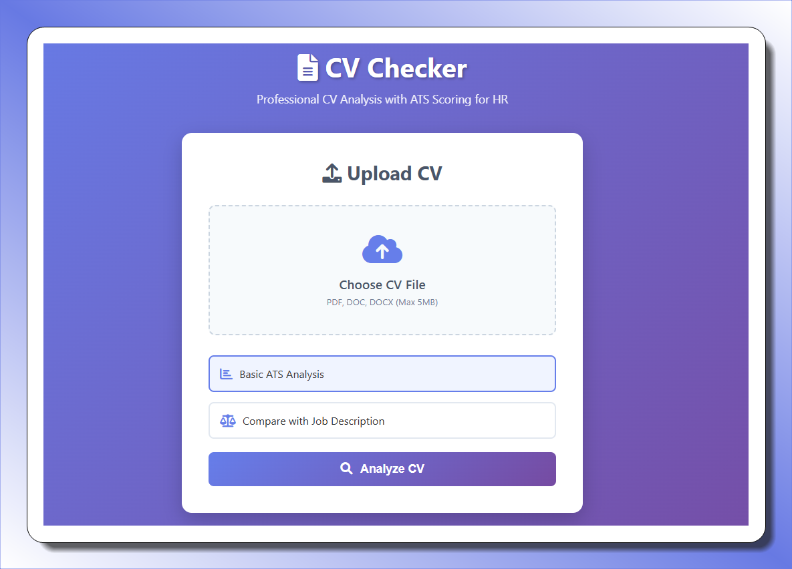

# CV Checker - ATS Score Analysis

<div align="center">
  <h3>Advanced CV Analysis Tool with ATS Scoring</h3>
  <p>
    <strong>A full-stack application for HR professionals to analyze CVs/resumes with ATS (Applicant Tracking System) scoring and AI-powered insights.</strong>
  </p>
  <p>
    
  </p>
</div>

## Features

<div align="center">


</div>

- **📄 CV Upload Support**: PDF, DOC, DOCX files up to 5MB
- **📊 ATS Scoring**: Comprehensive scoring based on:
  - Contact information completeness
  - Skills section presence
  - Work experience documentation
  - Education details
  - Keyword matching with job descriptions
  - Document formatting and structure
- **🤖 AI Analysis**: Powered by Google's Gemini 2.0 Flash for detailed feedback
- **🔍 Job Comparison**: Compare CVs against specific job descriptions
- **💻 Professional UI**: Clean, responsive design for HR workflows

## Tech Stack

### Backend

<div align="center">


</div>

- Node.js with Express
- Google Generative AI (Gemini 2.0 Flash)
- PDF parsing with pdf-parse
- Word document parsing with mammoth
- File upload handling with multer

### Frontend

<div align="center">


</div>

- Vanilla HTML, CSS, JavaScript
- Responsive design
- Font Awesome icons
- Modern gradient UI

## Setup Instructions

### Prerequisites

<div align="center">


</div>

- Node.js (v14 or higher)
- Google AI API key (Gemini)

### Backend Setup

1. Navigate to the backend directory:

```bash
cd backend
```

2. Install dependencies:

```bash
npm install
```

3. Configure environment variables:

   - Open `.env` file
   - Replace `your_gemini_api_key_here` with your actual Google AI API key
   - Get your API key from: https://makersuite.google.com/app/apikey

4. Start the server:

```bash
npm run dev
```

The backend will run on `http://localhost:3000`

### Frontend Setup

1. Navigate to the frontend directory:

```bash
cd frontend
```

2. Serve the frontend files using a local server:
   - Using Python: `python -m http.server 8080`
   - Using Node.js: `npx serve .`
   - Or open `index.html` directly in your browser

The frontend will be available at `http://localhost:8080` (or your chosen port)

<div align="center">


</div>

## Usage

<div align="center">


</div>

1. **📤 Upload CV**: Select or drag-and-drop a CV file (PDF, DOC, DOCX)

2. **⚙️ Choose Analysis Type**:

   - **Basic Analysis**: General ATS scoring and AI feedback
   - **Job Comparison**: Compare CV against a specific job description

3. **📈 View Results**:
   - ATS score out of 100 with grade (Excellent/Good/Fair/Poor)
   - Detailed breakdown by category
   - AI-powered analysis and recommendations

## API Endpoints

<div align="center">


</div>

### POST `/api/cv/analyze`

Analyze a CV file and return ATS score with AI insights.

**Request**: Multipart form data with CV file
**Response**:

```json
{
  "success": true,
  "data": {
    "fileName": "resume.pdf",
    "atsScore": {
      "totalScore": 85,
      "grade": "Excellent",
      "breakdown": { ... }
    },
    "aiAnalysis": "Detailed AI feedback...",
    "timestamp": "2024-01-01T00:00:00.000Z"
  }
}
```

### POST `/api/cv/compare`

Compare a CV against a job description.

**Request**: Multipart form data with CV file and job description
**Response**: Similar to analyze endpoint with comparison analysis

## ATS Scoring Criteria

<div align="center">


</div>

- **Contact Information** (20 points): Email and phone number presence
- **Skills Section** (25 points): Dedicated skills or competencies section
- **Work Experience** (25 points): Employment history documentation
- **Education** (15 points): Educational background details
- **Keyword Matching** (10 points): Relevance to job description (when provided)
- **Formatting** (5 points): Document structure and readability

## Security Features

<div align="center">


</div>

- File type validation (PDF, DOC, DOCX only)
- File size limits (5MB maximum)
- Automatic file cleanup after processing
- Input sanitization and error handling

## Contributing

<div align="center">


</div>

1. Fork the repository
2. Create a feature branch
3. Make your changes
4. Test thoroughly
5. Submit a pull request

## License

This project is licensed under the ISC License.

## Support

For issues or questions, please create an issue in the repository or contact the development team.

---

<div align="center">


[](https://github.com/bouzayenilyes)
[](https://github.com/bouzayenilyes/ATSchecker)

<p>⭐ If you find this project helpful, please consider giving it a star! ⭐</p>

</div>
